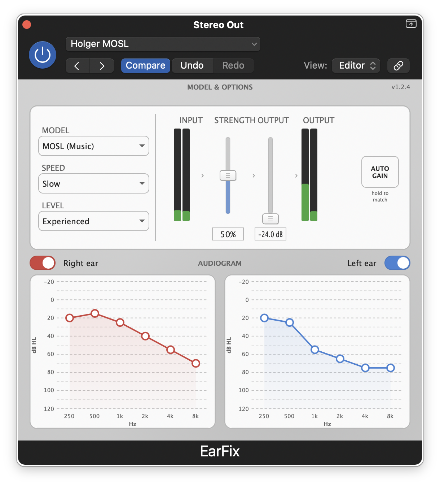

# EarFix

**Hearing correction audio plugin based on your audiogram**

EarFix is a free, open-source audio plugin that applies personalized hearing correction to any audio source. Enter your audiogram data (from a hearing test) and EarFix compensates for your specific hearing loss profile in real-time.



## Features

- **Personalized Correction**: Enter your audiogram values for 6 standard frequencies (250Hz - 8kHz)
- **Three Correction Models**:
  - **Half-Gain**: Simple, transparent correction (applies 50% of hearing loss as gain)
  - **NAL (Speech)**: Clinical-grade algorithm with compression (based on National Acoustic Laboratories formula)
  - **MOSL (Music)**: Music-optimized specific loudness restoration with gentle compression and preserved dynamics
- **Auto-Gain**: Hold the button to automatically match output level to input level
- **Level Metering**: Stereo input and output meters for visual feedback
- **Independent Ear Control**: Separate audiograms and enable/disable for left and right ears
- **Adjustable Strength**: Scale correction from 0-100% to find your comfort level
- **Output Gain**: Master volume control with +/-24dB range
- **Premium UI**: Clean, professional interface with interactive audiogram charts and signal flow visualization

## Supported Formats

| Format | macOS | Windows |
|--------|-------|---------|
| AU (Audio Unit) | Yes | N/A |
| VST3 | Yes | Planned |
| AUv3 | Yes | N/A |
| AAX | Yes | Planned |

## Requirements

- **macOS**: 10.13 (High Sierra) or later
- **Architecture**: Universal Binary (Apple Silicon & Intel)

## Installation

See [INSTALL.md](INSTALL.md) for detailed installation instructions.

**Quick Install (macOS):**
1. Download the latest release from [Releases](https://github.com/sneakinhysteria/EarFix/releases)
2. Copy `EarFix.component` to `~/Library/Audio/Plug-Ins/Components/`
3. Copy `EarFix.vst3` to `~/Library/Audio/Plug-Ins/VST3/`
4. Restart your DAW

## Usage

See the [User Guide](docs/USER_GUIDE.md) for complete documentation.

**Quick Start:**
1. Insert EarFix on a track or master bus
2. Enter your audiogram values (hearing threshold in dB HL) for each frequency
3. Choose a correction model (start with Half-Gain)
4. Adjust correction strength to taste
5. Enable/disable individual ears as needed

## How It Works

EarFix uses your audiogram data to calculate frequency-specific gain curves:

- **Half-Gain Rule**: For each frequency, applies gain equal to half your hearing threshold. Simple and effective for mild-moderate hearing loss.

- **NAL (Speech)**: Applies the National Acoustic Laboratories' Non-Linear 2 prescription formula, which accounts for loudness recruitment and provides compression for speech intelligibility.

- **MOSL (Music)**: Music-Optimized Specific Loudness model that preserves spectral balance and musical dynamics. Uses gentler compression (max 1.7:1) and slower time constants to avoid "pumping" artifacts common with speech-focused algorithms.

## Building from Source

### Prerequisites
- [JUCE Framework](https://juce.com/) (tested with JUCE 7.x)
- Xcode 14+ (macOS)
- Projucer (included with JUCE)

### Build Steps
```bash
# Clone the repository
git clone https://github.com/sneakinhysteria/EarFix.git
cd EarFix

# Open in Projucer and save to generate Xcode project
# Or use existing Xcode project:
cd Builds/MacOSX
xcodebuild -project EarFix.xcodeproj -scheme "EarFix - All" -configuration Release
```

## Contributing

Contributions are welcome! Please feel free to submit issues and pull requests.

1. Fork the repository
2. Create your feature branch (`git checkout -b feature/amazing-feature`)
3. Commit your changes (`git commit -m 'Add amazing feature'`)
4. Push to the branch (`git push origin feature/amazing-feature`)
5. Open a Pull Request

## License

This project is licensed under the MIT License - see the [LICENSE](LICENSE) file for details.

## Acknowledgments

- [JUCE Framework](https://juce.com/) - Cross-platform audio application framework
- NAL-NL2 prescription formula by the National Acoustic Laboratories, Australia
- Inspired by the need for accessible hearing correction tools

## Disclaimer

EarFix is not a medical device and is not intended to replace professional hearing aids or audiological care. Always consult with a qualified audiologist for hearing health concerns. The correction provided is based on simplified models and may not be suitable for all types of hearing loss.

---

<a href="https://www.buymeacoffee.com/sneakinhysteria" target="_blank"></a>
