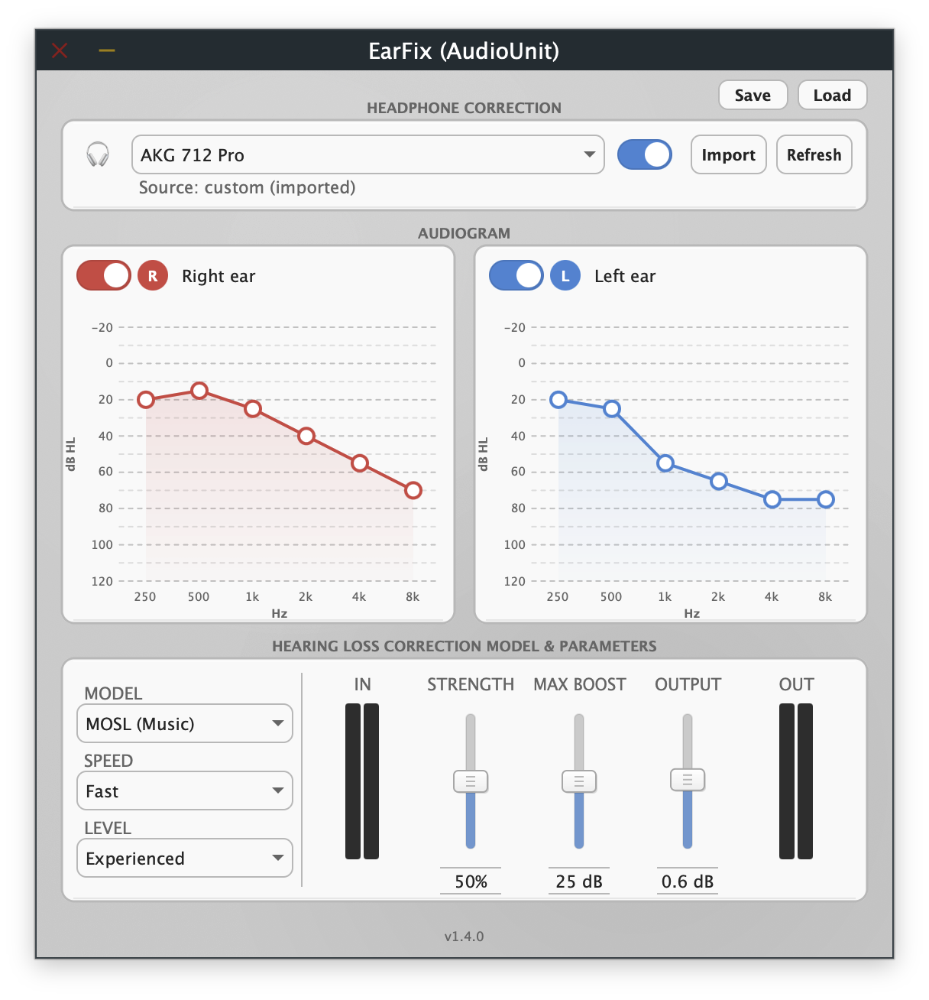

# EarFix

**Hearing correction audio plugin based on your audiogram**

EarFix is a free, open-source audio plugin that applies personalized hearing correction to any audio source. Enter your audiogram data (from a hearing test) and EarFix compensates for your specific hearing loss profile in real-time.



## Download

**[Download EarFix for macOS (latest)](https://github.com/sneakinhysteria/EarFix/releases/latest/download/EarFix-macOS.zip)** (AU + VST3, signed & notarized)

**[Download EarFix for Windows (latest)](https://github.com/sneakinhysteria/EarFix/releases/latest/download/EarFix-Windows.zip)** (VST3)

After downloading:
1. Unzip the downloaded file
2. **macOS**: copy `EarFix.component` to `~/Library/Audio/Plug-Ins/Components/` and `EarFix.vst3` to `~/Library/Audio/Plug-Ins/VST3/`
   **Windows**: copy `EarFix.vst3` to `C:\Program Files\Common Files\VST3\`
3. Restart your DAW

See [all releases](https://github.com/sneakinhysteria/EarFix/releases) for release notes and older versions.

## Features

- **Personalized Correction**: Enter your audiogram values for 6 standard frequencies (250Hz - 8kHz), per ear
- **Loudness-Neutral Correction**: Correction curves are centered using perceptual (K-weighted) loudness, so corrected output matches your source material's loudness instead of getting louder as prescribed gain increases
- **Multiband WDRC**: Phase-compensated 6-band Linkwitz-Riley crossover with Wide Dynamic Range Compression per band
- **Three Correction Models**:
  - **Half-Gain**: Simple, transparent correction (applies 50% of hearing loss as gain), no compression
  - **NAL (Speech)**: Clinical-grade algorithm with compression (based on National Acoustic Laboratories formula)
  - **MOSL (Music)**: Music-optimized specific loudness restoration with gentle compression and preserved dynamics
- **Max Boost Control**: Limit per-band gain (10-40dB) for hearing safety
- **Level Metering**: Stereo input and output meters for visual feedback
- **Independent Ear Control**: Separate audiograms and enable/disable for left and right ears
- **Adjustable Strength**: Scale correction from 0-100% to find your comfort level
- **Output Gain**: Master volume control with +/-24dB range
- **Headphone Correction**: Flatten your headphones' response before hearing correction is applied. Paste in a Parametric EQ profile (from [AutoEq](https://github.com/jaakkopasanen/AutoEq), [squig.link](https://squig.link), or [oratory1990](https://www.reddit.com/r/oratory1990/)) for any headphone
- **AU Presets**: Save/load presets in the standard `.aupreset` format, interchangeable with Logic and other AU hosts
- **Premium UI**: Clean, professional interface with interactive audiogram charts and signal flow visualization

## Supported Formats

| Format | macOS | Windows |
|--------|-------|---------|
| AU (Audio Unit) | Yes | N/A |
| VST3 | Yes | Yes |
| AUv3 | Yes | N/A |

Pro Tools (AAX) is not supported — AAX requires a paid Avid developer partnership, iLok hardware, and PACE code-signing, which isn't worth the overhead for a free plugin.

## Requirements

- **macOS**: 10.13 (High Sierra) or later
- **Architecture**: Universal Binary (Apple Silicon & Intel)

## Installation

See [INSTALL.md](INSTALL.md) for detailed installation instructions.

**Quick Install (macOS):**
1. Download the latest release from [Releases](https://github.com/sneakinhysteria/EarFix/releases)
2. Copy `EarFix.component` to `~/Library/Audio/Plug-Ins/Components/`
3. Copy `EarFix.vst3` to `~/Library/Audio/Plug-Ins/VST3/`
4. Restart your DAW

## Usage

See the [User Guide](docs/USER_GUIDE.md) for complete documentation.

**Quick Start:**
1. Insert EarFix on a track or master bus
2. Enter your audiogram values (hearing threshold in dB HL) for each frequency
3. Choose a correction model (start with Half-Gain)
4. Adjust correction strength to taste
5. Enable/disable individual ears as needed

## How It Works

EarFix splits audio into 6 bands (matching the 250Hz-8kHz audiogram frequencies) using a phase-compensated Linkwitz-Riley crossover, then applies gain per band based on your audiogram and chosen correction model. Signal flow is: **headphone EQ** (flattens your headphones' own response, if a profile is loaded) → **hearing correction** (reshapes the now-neutral signal for your audiogram) → **output gain**.

The per-band correction curve is centered using perceptual (K-weighted) loudness, so a flat hearing loss produces no change in level (only compression), and a sloping loss produces a spectral tilt without making the overall signal louder than the source. Wide Dynamic Range Compression (WDRC) then eases the correction toward flat as input level rises, so quiet passages get the full prescribed correction and loud passages approach the original spectrum.

**Correction Models:**

- **Half-Gain Rule**: For each frequency, applies gain equal to half your hearing threshold. No compression — simple and transparent.

- **NAL (Speech)**: Applies a National Acoustic Laboratories'-inspired prescription formula with frequency shaping and WDRC compression, tuned for speech intelligibility.

- **MOSL (Music)**: Music-Optimized Specific Loudness model that preserves spectral balance and musical dynamics. Uses gentler compression (max 1.7:1) and slower time constants to avoid "pumping" artifacts common with speech-focused algorithms.

**Safety Features:**

The Max Boost control (10-40dB) limits the maximum gain applied in any frequency band, protecting your hearing from excessive amplification.

## Building from Source

### Prerequisites
- [JUCE Framework](https://juce.com/) (tested with JUCE 8.x)
- Xcode 14+ (macOS)
- Projucer (included with JUCE)

### Build Steps
```bash
# Clone the repository
git clone https://github.com/sneakinhysteria/EarFix.git
cd EarFix

# Open in Projucer and save to generate Xcode project
# Or use existing Xcode project:
cd Builds/MacOSX
xcodebuild -project EarFix.xcodeproj -scheme "EarFix - All" -configuration Release
```

## Contributing

Contributions are welcome! Please feel free to submit issues and pull requests.

1. Fork the repository
2. Create your feature branch (`git checkout -b feature/amazing-feature`)
3. Commit your changes (`git commit -m 'Add amazing feature'`)
4. Push to the branch (`git push origin feature/amazing-feature`)
5. Open a Pull Request

## License

This project is licensed under the MIT License - see the [LICENSE](LICENSE) file for details.

## Acknowledgments

- [JUCE Framework](https://juce.com/) - Cross-platform audio application framework
- NAL-NL2 prescription research by the National Acoustic Laboratories, Australia, which inspired the NAL correction model
- MOSL model based on research from:
  - Fitz & McKinney (Starkey) - Specific loudness restoration for music
  - Moore & Glasberg (Cambridge) - Loudness perception and hearing loss models
  - Marshall Chasin - Music program optimization guidelines for hearing aids
- [AutoEQ](https://github.com/jaakkopasanen/AutoEq) by Jaakko Pasanen - Parametric EQ format EarFix's headphone import supports
- [oratory1990](https://www.reddit.com/r/oratory1990/) and [squig.link](https://squig.link) - Headphone measurement sources compatible with EarFix's headphone import
- Inspired by the need for accessible hearing correction tools

## Disclaimer

EarFix is not a medical device and is not intended to replace professional hearing aids or audiological care. Always consult with a qualified audiologist for hearing health concerns. The correction provided is based on simplified models and may not be suitable for all types of hearing loss.

---

<a href="https://www.buymeacoffee.com/sneakinhysteria" target="_blank"></a>
