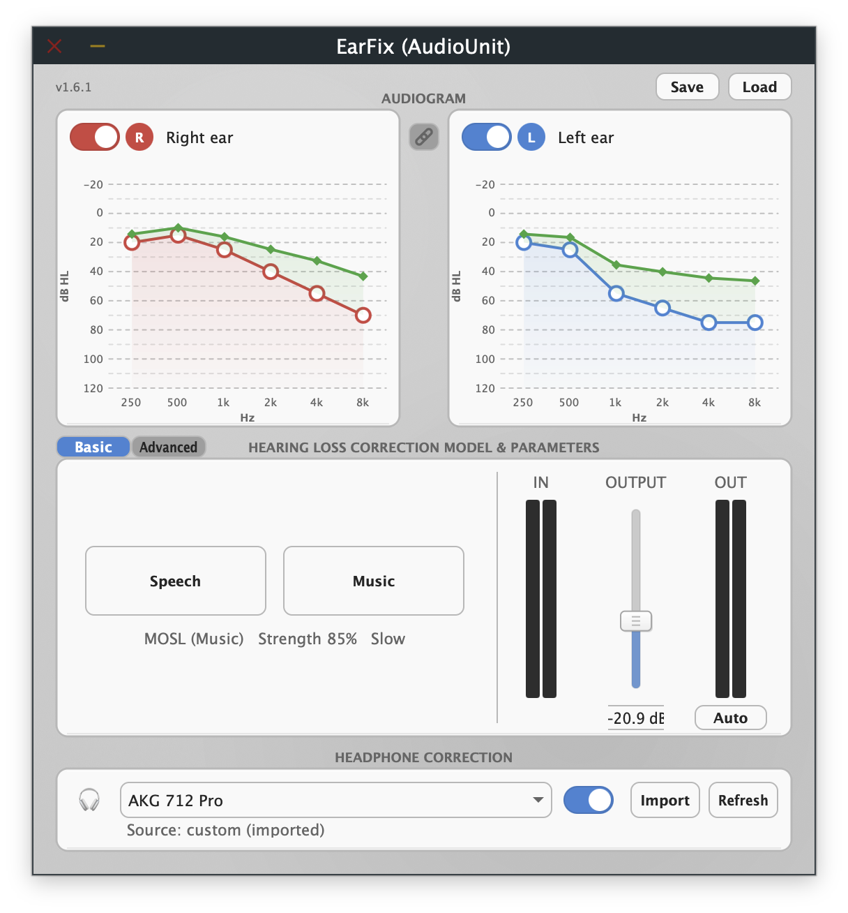
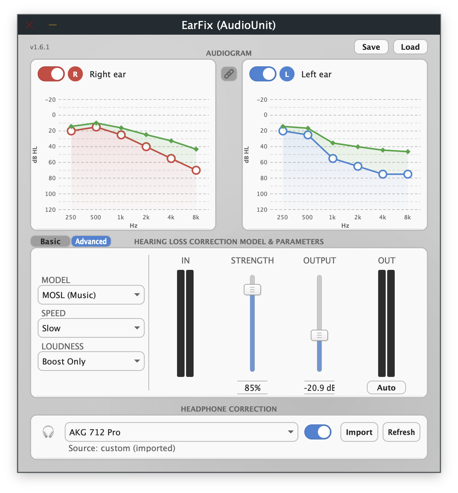

# EarFix

**Hearing correction audio plugin based on your audiogram**

EarFix is a free, open-source audio plugin that applies personalized hearing correction to any audio source. Enter your audiogram data (from a hearing test) and EarFix compensates for your specific hearing loss profile in real-time.

<table>
<tr>
<td align="center"><b>Basic mode</b><br></td>
<td align="center"><b>Advanced mode</b><br></td>
</tr>
</table>

## Download

**[Download EarFix for macOS (latest)](https://github.com/sneakinhysteria/EarFix/releases/latest/download/EarFix-macOS.zip)** (AU + VST3, signed & notarized)

**[Download EarFix for Windows (latest)](https://github.com/sneakinhysteria/EarFix/releases/latest/download/EarFix-Windows.zip)** (VST3)

After downloading:
1. Unzip the downloaded file
2. **macOS**: copy `EarFix.component` to `~/Library/Audio/Plug-Ins/Components/` and `EarFix.vst3` to `~/Library/Audio/Plug-Ins/VST3/`
   **Windows**: copy `EarFix.vst3` to `C:\Program Files\Common Files\VST3\`
3. Restart your DAW

See [all releases](https://github.com/sneakinhysteria/EarFix/releases) for release notes and older versions.

## Features

- **Personalized Correction**: Enter your audiogram values for 6 standard frequencies (250Hz - 8kHz), per ear
- **Basic & Advanced modes**: Basic offers one-click **Speech** and **Music** presets grounded in hearing-aid fitting practice; Advanced exposes the full control set. Both drive the same underlying settings
- **Three Correction Models**:
  - **Half-Gain**: Simple, transparent correction (applies 50% of hearing loss as gain), no compression
  - **NAL (Speech)**: Clinical-grade algorithm with compression (based on National Acoustic Laboratories formula)
  - **MOSL (Music)**: Music-optimized specific loudness restoration with gentle compression and preserved dynamics
- **Two Loudness Modes**: *Boost Only* (default) never cuts a band — it applies your prescribed correction and leaves overall level to the Output stage; *Centered* holds perceived (K-weighted) loudness constant across the reshape
- **Multiband WDRC**: Phase-compensated 6-band Linkwitz-Riley crossover with Wide Dynamic Range Compression per band
- **One-click Auto level match**: Sets Output so the corrected signal sits at the same loudness as your source, measured from the actual signal while it plays
- **Output Gain**: Master output trim, -48 to +24 dB — wide enough to tame the large boosts correction can add, so you never have to turn down your source or system volume
- **Level Metering**: Stereo input and output meters for visual feedback
- **Independent Ear Control**: Separate audiograms and enable/disable for left and right ears, with a link toggle
- **Adjustable Strength**: Scale correction from 0-100% to find your comfort level
- **Headphone Correction**: Loudness-neutral EQ that flattens your headphones' own response. Paste in a Parametric EQ profile (from [AutoEq](https://github.com/jaakkopasanen/AutoEq), [squig.link](https://squig.link), or [oratory1990](https://www.reddit.com/r/oratory1990/)) for any headphone
- **AU Presets**: Save/load presets in the standard `.aupreset` format, interchangeable with Logic and other AU hosts
- **Premium UI**: Clean, professional interface with interactive audiogram charts and signal flow visualization

## Supported Formats

| Format | macOS | Windows |
|--------|-------|---------|
| AU (Audio Unit) | Yes | N/A |
| VST3 | Yes | Yes |
| AUv3 | Yes | N/A |

Pro Tools (AAX) is not supported — AAX requires a paid Avid developer partnership, iLok hardware, and PACE code-signing, which isn't worth the overhead for a free plugin.

## Requirements

**macOS**
- macOS 10.13 (High Sierra) or later
- Universal Binary (Apple Silicon & Intel)

**Windows**
- Windows 10 (version 1607+) or Windows 11
- 64-bit (x64) only — no 32-bit or ARM64 build; your DAW must also be running as a 64-bit process
- [Microsoft Visual C++ Redistributable (x64)](https://aka.ms/vc14/vc_redist.x64.exe) — required for the plugin to load; most DAWs already install this, but a fresh Windows install may not have it

## Installation

See [INSTALL.md](INSTALL.md) for detailed installation instructions.

**Quick Install (macOS):**
1. Download the latest release from [Releases](https://github.com/sneakinhysteria/EarFix/releases)
2. Copy `EarFix.component` to `~/Library/Audio/Plug-Ins/Components/`
3. Copy `EarFix.vst3` to `~/Library/Audio/Plug-Ins/VST3/`
4. Restart your DAW

## Usage

See the [User Guide](docs/USER_GUIDE.md) for complete documentation.

**Quick Start:**
1. Insert EarFix on a track or master bus
2. Enter your audiogram values (hearing threshold in dB HL) for each frequency, per ear
3. In **Basic** mode, click **Speech** or **Music** for a research-grounded starting point — or switch to **Advanced** to pick a model and set strength yourself
4. Play audio and click **Auto** to match the output loudness to your source
5. Switch to Advanced any time to fine-tune (model, strength, loudness mode, compression speed)

**Running EarFix on all your system audio:** EarFix is a plugin, so it needs a host to run in — normally a DAW. For applying it system-wide (music playback, browser, etc.) on macOS, [Curve](https://github.com/tomderham/curve) is a free, open-source, driverless AU/VST3 host that taps your system audio — no separate driver install required. Load EarFix as a Curve node on your system audio output.

## How It Works

EarFix splits audio into 6 bands (matching the 250Hz-8kHz audiogram frequencies) using a phase-compensated Linkwitz-Riley crossover, then applies gain per band based on your audiogram and chosen correction model. Signal flow is: **hearing correction** (reshapes the signal for your audiogram) → **headphone EQ** (flattens your headphones' own response, if a profile is loaded) → **output gain**. Hearing correction comes first so its level-dependent compression responds to the clean source dynamics rather than to a signal already colored by the headphone-inverse EQ; the net frequency response is the same either way, since the two filter stages combine identically regardless of order. The plugin's own card order (Audiogram → Hearing Loss Correction → Headphone Correction) mirrors this signal flow.

In the default **Boost Only** loudness mode, each band gets its model-prescribed gain and no band is ever cut, so the correction can run louder than the source — the **Auto** button (or the Output fader) brings that back to the source's loudness by measuring the actual processed vs. input level. The alternative **Centered** mode instead holds perceived (K-weighted) loudness constant across the reshape, so a flat hearing loss produces no change in level and a sloping loss produces a spectral tilt without getting louder. In both modes, Wide Dynamic Range Compression (WDRC) eases the correction toward flat as input level rises, so quiet passages get the full prescribed correction and loud passages approach the original spectrum.

**Correction Models:**

- **Half-Gain Rule**: For each frequency, applies gain equal to half your hearing threshold. No compression — simple and transparent.

- **NAL (Speech)**: Applies a National Acoustic Laboratories'-inspired prescription formula with frequency shaping and WDRC compression, tuned for speech intelligibility.

- **MOSL (Music)**: Music-Optimized Specific Loudness model that preserves spectral balance and musical dynamics. Uses gentler compression (max 1.7:1) and slower time constants to avoid "pumping" artifacts common with speech-focused algorithms.

**Level Management:**

Correction can add substantial gain, so overall level is managed at the output rather than by reducing your source (which would lose quality before the signal reaches EarFix). The Output fader trims down to -48 dB, and the **Auto** button sets it automatically to match the corrected signal's loudness to your input. A fixed internal ceiling caps any single band's gain so no frequency is over-amplified.

## Building from Source

### Prerequisites
- [JUCE Framework](https://juce.com/) (tested with JUCE 8.x)
- Xcode 14+ (macOS)
- Projucer (included with JUCE)

### Build Steps
```bash
# Clone the repository
git clone https://github.com/sneakinhysteria/EarFix.git
cd EarFix

# Open in Projucer and save to generate Xcode project
# Or use existing Xcode project:
cd Builds/MacOSX
xcodebuild -project EarFix.xcodeproj -scheme "EarFix - All" -configuration Release
```

## Contributing

Contributions are welcome! Please feel free to submit issues and pull requests.

1. Fork the repository
2. Create your feature branch (`git checkout -b feature/amazing-feature`)
3. Commit your changes (`git commit -m 'Add amazing feature'`)
4. Push to the branch (`git push origin feature/amazing-feature`)
5. Open a Pull Request

## License

This project is licensed under the MIT License - see the [LICENSE](LICENSE) file for details.

## Acknowledgments

- [JUCE Framework](https://juce.com/) - Cross-platform audio application framework
- NAL-NL2 prescription research by the National Acoustic Laboratories, Australia, which inspired the NAL correction model
- MOSL model based on research from:
  - Fitz & McKinney (Starkey) - Specific loudness restoration for music
  - Moore & Glasberg (Cambridge) - Loudness perception and hearing loss models
  - Marshall Chasin - Music program optimization guidelines for hearing aids
- [AutoEQ](https://github.com/jaakkopasanen/AutoEq) by Jaakko Pasanen - Parametric EQ format EarFix's headphone import supports
- [oratory1990](https://www.reddit.com/r/oratory1990/) and [squig.link](https://squig.link) - Headphone measurement sources compatible with EarFix's headphone import
- Inspired by the need for accessible hearing correction tools

## Disclaimer

EarFix is not a medical device and is not intended to replace professional hearing aids or audiological care. Always consult with a qualified audiologist for hearing health concerns. The correction provided is based on simplified models and may not be suitable for all types of hearing loss.

---

<a href="https://www.buymeacoffee.com/sneakinhysteria" target="_blank"></a>
